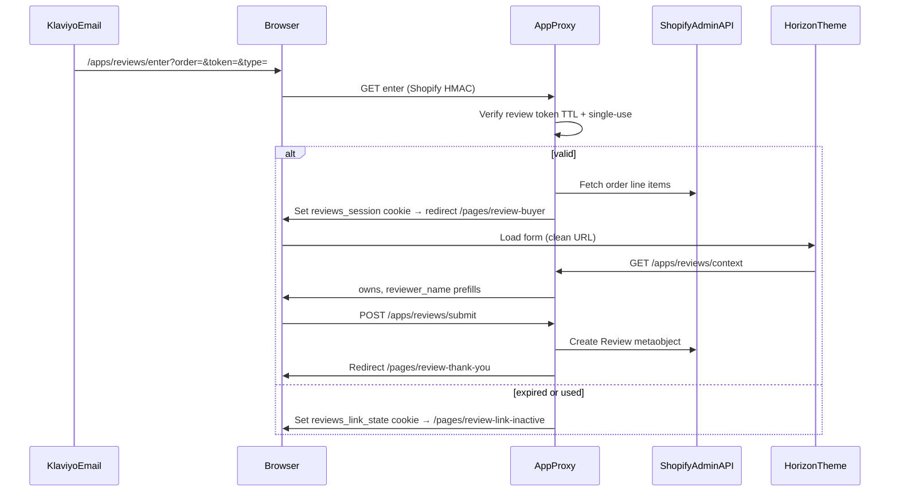

# Reviews System — Milestone 3 (architecture decisions)

**Governing spec:** Build Guide §4.4–§4.5, §5.1–§5.5b — [`docs/client docs/ReviewsSystemBuildGuide.md`](../client%20docs/ReviewsSystemBuildGuide.md)  
**Gate deadline:** Submit May 31 → review by June 3  
**Related:** [`reviews-milestones.md`](./reviews-milestones.md) (M1–M2), [`reviews-metaobject-seed.md`](./reviews-metaobject-seed.md)

---

## What was built

M3 delivers the **backend submission pipeline** and **theme form surfaces** for all four reviewer types. A custom Shopify app (separate repo: `myduggie-app`) handles App Proxy routes with HMAC validation, signed token entry, session cookies, order lookup, and Review metaobject writes (`status=approved`). The Horizon theme adds §5.1–§5.4 form pages, §5.5 thank-you, and §5.5b cookie-driven inactive routing.

---

## App location (not in theme repo)

The submission backend lives in **`/Users/usman/Desktop/dev/myduggie-app`** (deployed separately). Theme repo has **no** `reviews-app/` folder.

| Artifact | Repo |
|----------|------|
| App Proxy, tokens, Admin API writes | `myduggie-app` |
| Form templates, JS bridge, thank-you / inactive UI | `myduggie` (this theme) |

---

## Architecture



---

## Key decisions

### Token signing secret — env var, not shop metafield

**Decision:** `REVIEWS_TOKEN_SECRET` on the app host (32+ byte random, per environment).  
**Why:** Single-merchant custom app; secret never touches theme Liquid or Admin API. Klaviyo receives only signed entry URLs from `/generate-token`, never the raw secret.  
**Note:** M2 milestones doc previously listed `custom.reviews_token_secret` — **removed**; that was from an obsolete plan.

### Single-use enforcement

**Decision:** Primary check = existing Review metaobject for `order_id` (one review per order, Build Guide §4.1).  
**Why:** Matches business rule; no separate `jti` registry unless gate QA finds an edge case.

### Session cookie strategy

**Decision:** HttpOnly signed cookie `reviews_session` (~30 min TTL) set at `/enter`; cleared on successful submit.  
**Why:** Storefront Liquid cannot read URL query params — session bridges token validation to clean form URLs.

### §5.5b state delivery

**Decision:** Readable cookie `reviews_link_state=expired|used` (5 min TTL) + theme JS on `/pages/review-link-inactive`. Theme editor **Preview state** remains for design-mode QA only.  
**Why:** Liquid has no access to proxy redirect state or query params on page templates.

### Order lookup timing (Build Guide §5.1 data-in vs data-out)

**Decision:** Admin API order fetch at **`/enter`** → `owns` / `owns_colors` stored in session → written to metaobject at **`/submit`** from session snapshot (browser POSTs rating, answers, photos only).  
**Why:** Form must pre-populate order context; server must not trust product refs from the client.

### `is_sample_reviewer` → `is_sample`

**Decision:** At submit, app reads customer metafield `custom.is_sample_reviewer` and copies to review `is_sample`.  
**Why:** Build Guide §4.4 auto-publish model; no per-review admin step.

### Photo storage

**Decision:** Client-side resize (max 2400px wide, max 1.5MB each, max 4) → multipart upload → Shopify Files → URLs in `photos` JSON.  
**Why:** Keeps metaobject JSON small; uses existing `write_files` scope.

### Admin notification

**Decision:** Informational log/stdout hook in app (`notify.ts`) — swap to email or Slack webhook without theme changes.  
**Why:** Fastest gate path; mechanism is app-side only.

### Gifter `gave` field

**Decision:** Empty array stub at M3 gate (`session.gave = []`).  
**Why:** Real data depends on Gift Flow Closing-Loop integration — follow-up when that event is wired on dev store.

### Hosting

**Decision:** Hono Node app on Heroku (see `myduggie-app/heroku.yml`).  
**Why:** Already deployed and App Proxy registered; Remix scaffold was considered but not used.

---

## App Proxy routes

Storefront prefix: `https://{shop}/apps/reviews/…` → app `/proxy/…`

| Subpath | Method | Purpose |
|---------|--------|---------|
| `/apps/reviews/enter` | GET | Validate token → redirect form or inactive |
| `/apps/reviews/context` | GET | Session prefill JSON |
| `/apps/reviews/submit` | POST | Create Review metaobject |
| `/apps/reviews/generate-token` | POST | Gate QA / Klaviyo URL minting |

**Two HMAC layers (gate focus):**

1. **Shopify App Proxy** — `signature` query param on every proxied request ([docs](https://shopify.dev/docs/apps/build/online-store/app-proxies/authenticate-app-proxies)).
2. **Review link token** — HMAC-SHA256 payload: `{ order_id, reviewer_type, iat, jti }`, 60-day TTL.

---

## Klaviyo entry URL contract

Email links must hit the **proxy**, never the theme page with query params:

```
https://{{ shop.domain }}/apps/reviews/enter?order={{ order_id }}&token={{ signed_token }}&type={{ reviewer_type }}
```

`reviewer_type`: `buyer` | `recipient` | `gifter` | `accessory`

**Generate test link** (app running):

```bash
curl -X POST "https://YOUR_APP_HOST/generate-token" \
  -H "Content-Type: application/json" \
  -H "X-Reviews-Api-Key: YOUR_GENERATE_TOKEN_API_KEY" \
  -d '{"order_id":"gid://shopify/Order/123","reviewer_type":"buyer"}'
```

See `myduggie-app/README.md` for env vars and deploy steps.

---

## Theme deliverables (this repo)

| File | Purpose |
|------|---------|
| `templates/page.review-buyer.json` | §5.1 |
| `templates/page.review-recipient.json` | §5.2 |
| `templates/page.review-gifter.json` | §5.3 |
| `templates/page.review-accessory.json` | §5.4 |
| `templates/page.review-thank-you.json` | §5.5 |
| `sections/review-form-*.liquid` | Type-specific forms (locked copy) |
| `sections/review-thank-you.liquid` | Thank-you card |
| `sections/review-link-inactive.liquid` | §5.5b + cookie JS |
| `assets/reviews-form.js` | Context fetch, validation, photos, submit |
| `assets/reviews-components.css` | Form + thank-you styles |

### Admin pages to create (dev + prod)

| Handle | Template |
|--------|----------|
| `review-buyer` | `page.review-buyer` |
| `review-recipient` | `page.review-recipient` |
| `review-gifter` | `page.review-gifter` |
| `review-accessory` | `page.review-accessory` |
| `review-thank-you` | `page.review-thank-you` |
| `review-link-inactive` | `page.review-link-inactive` (M2 — already exists) |

---

## Gate QA checklist

| Test | Expected |
|------|----------|
| HMAC tamper | Modify proxy `signature` → 401, no form access |
| Valid buyer token | Buyer form; owns prefilled from order |
| Submit buyer review | Metaobject `status=approved`, correct `owns`/`owns_colors`, `is_sample` copied |
| Replay same link | §5.5b "already submitted" |
| Expired token (`iat` > 60d) | §5.5b "expired" |
| Invalid/tampered token | §5.5b expired copy |
| Recipient / gifter / accessory | Correct form + `reviewer_type` on write |
| Missing required fields | Inline validation, no write |
| 5th photo | Rejected client-side |
| Thank-you | Verbatim §5.5 copy |

Capture: screenshots, Admin metaobject entries, HMAC walkthrough notes.

---

## Trade-offs

- **Two deploy artifacts** — app must be live and proxy registered before E2E form submit works.
- **Gifter `gave` stubbed** — card "Gave" row empty until Gift Flow data wired.
- **Returns badge** — still TEMP-DEV (`answers.order_returned`); live fulfillment lookup deferred.
- **Secret rotation** — redeploy with new `REVIEWS_TOKEN_SECRET`; outstanding links invalid (max 60-day TTL anyway).

---

## Out of scope (M4+)

- PDP reviews surface §5.10–5.12
- Product rollup webhook (`review_count` / `average_rating`)
- Klaviyo production flows (URL contract only)
- Moderation admin UI
- Photo lightbox on cards
- Aggregate empty state (M6)
